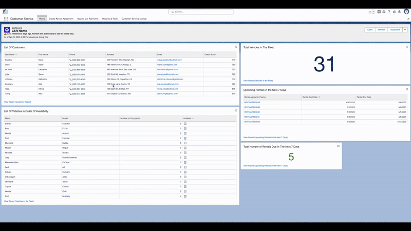
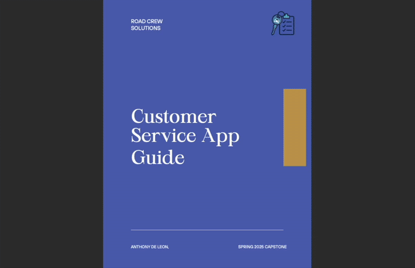

# Car Rental System

## 📝 Project Overview
This project involved the professional development of a Salesforce solution that is designed to manage the core operations of a car rental business through two dedicated applications — one for customer service and one for vehicle maintenance. This project demonstrates my ability to plan and implement a complete CRM system using Salesforce tools, including custom data modeling, flows, automation, dashboards, and user-centered design.

The system supports real-world business processes such as rental agreement creation, payment handling, vehicle maintenance scheduling, and service history tracking. Each app is tailored to the daily responsibilities of its intended user, providing a clear, streamlined experience backed by automation and a clean platform.

---

## 👨‍💻 Customer Service App 

### 📄 [Rental Agreement PDF](./SalesforceCustomerServiceGuide.pdf)

### 🎥 [Customer Service App – Video Tutorials](https://vimeo.com/showcase/11687420)

The **Customer Service App** is designed for rental agents to manage the complete vehicle rental process with speed and clarity. With a screen flow this app walks users step-by-step through finding available vehicles, entering customer details, and finalizing rental agreements — all within a clean and guided Salesforce interface.

### Key Features

- **Home Page Dashboard** - Central hub for accessing vehicles, customers, and upcoming rental agreements.
- **Vehicle Availability Search** - Instantly see which vehicles are available based on rental dates and seating capacity.
- **Rental Agreement Builder** - A custom **Screen Flow** that walks agents through the rental process — including customer data entry, driver info, vehicle availability, and payment collection.
- **Payment Updates** - Easily view and update payment records with the latest amounts, methods, and statuses.
- **Reports & Tools** - Quick access to customers, drivers, rental agreements, and payments — all in one place.

Every tool within the app is designed for ease of use, supporting the fast-paced needs of a customer-facing environment. Video walkthroughs are provided for training and onboarding purposes.

---

## 🧰 Vehicle Maintenance App
