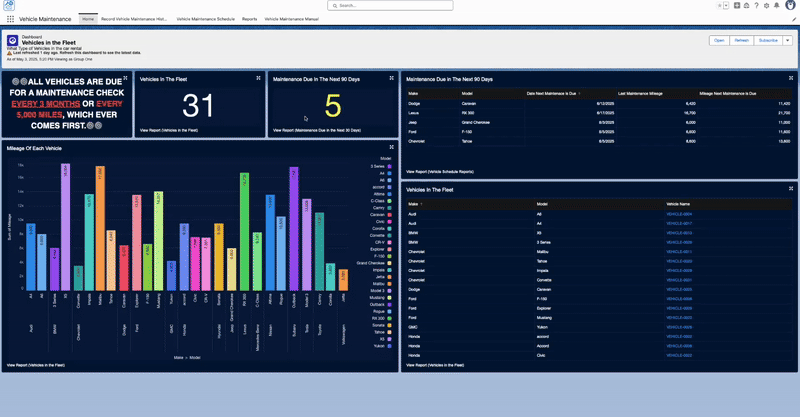
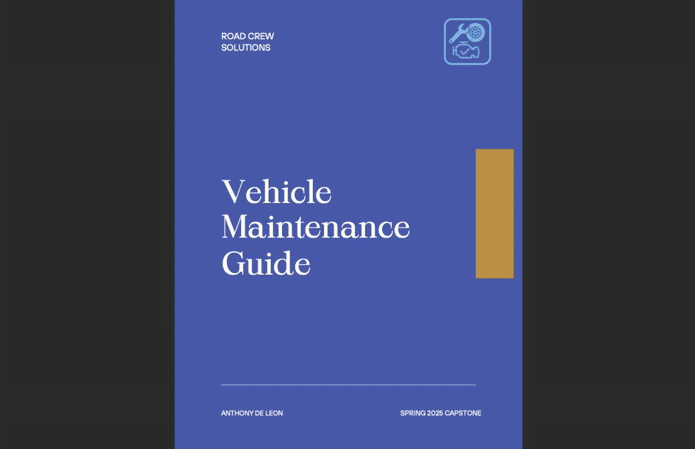

# Car Rental System

## 📑 Table of Contents

- [📝 Project Overview](#-project-overview)
- [👨‍💻 Customer Service App](#-customer-service-app)
  - [📄 Click Here For The Full Customer Service Guide](#-click-here-for-the-full-customer-service-guide)
  - [🎥 Click Here For Full Customer Service App – Video Tutorials](#-click-here-for-full-customer-service-app--video-tutorials)
  - [🔑 Key Features](#-app-key-features)
- [🧰 Vehicle Maintenance App](#-vehicle-maintenance-app)
  - [📄 Click Here For The Full Vehicle Maintenance Guide](#-click-here-for-the-full-vehicle-maintenance-guide)
  - [🎥 Click Here For Full Vehicle Maintenance App - Video Tutorials](#-click-here-for-full-vehicle-maintenance-app---video-tutorials)
  - [🔑 Key Features](#-key-features)

## 📝 Project Overview
This project involved the professional development of a Salesforce solution that is designed to manage the core operations of a car rental business through two dedicated applications — one for customer service and one for vehicle maintenance. This project demonstrates my ability to plan and implement a complete CRM system using Salesforce tools, including custom data modeling, flows, automation, dashboards, and user-centered design.

The system supports real-world business processes such as rental agreement creation, payment handling, vehicle maintenance scheduling, and service history tracking. Each app is tailored to the daily responsibilities of its intended user, providing a clear, streamlined experience backed by automation and a user friendly platform.

---

## 👨‍💻 Customer Service App 

### 📄 [Click Here For The Full Customer Service Guide](./SalesforceCustomerServiceGuide.pdf)

### 🎥 [Click Here For Full Customer Service App – Video Tutorials](https://vimeo.com/showcase/11687420)

The **Customer Service App** is designed for rental agents to manage the complete vehicle rental process with speed and clarity. With a screen flow this app walks users step-by-step through finding available vehicles, entering customer details, and finalizing rental agreements — all within a clean and guided Salesforce interface.

### 🔑 App Key Features

- **Home Page Dashboard** - Central hub for accessing vehicles, customers, and upcoming rental agreements.
- **Vehicle Availability Search** - Instantly see which vehicles are available based on rental dates and seating capacity.
- **Rental Agreement Builder** - A custom **Screen Flow** that walks agents through the rental process — including customer data entry, driver info, vehicle availability, and payment collection.
- **Payment Updates** - Easily view and update payment records with the latest amounts, methods, and statuses.
- **Reports & Tools** - Quick access to customers, drivers, rental agreements, and payments — all in one place.

---

## 🧰 Vehicle Maintenance App

### 📄 [Click Here For The Full Vehicle Maintenance Guide](./SalesforceVehicleMaintenanceGuide.pdf)

### 🎥 [Click Here For Full Vehicle Maintenance App - Video Tutorials](https://vimeo.com/showcase/11693718)

The **Vehicle Maintenance App** is built to help the maintenance team manage vehicle upkeep with structure and precision. From setting recurring service schedules to tracking past maintenance, every feature is designed to support reliable operations and reduce manual oversight.

### 🔑 Key Features

- **Home Page Dashboard** - A central view to monitor upcoming maintenance, track vehicle records, and stay on top of keeping vehilcles at optimal performance.
- **Service History Tracking** - Log and review past maintenance to ensure a complete record of all sercvices performed on vehicles.
- **Scheduled Maintenance Setup** - Schedule future services with **Recorded-Triggered Flows** that automatically calculate the next due date.
- **Quick Access To Reports** - Easily view and update both current and old records.

